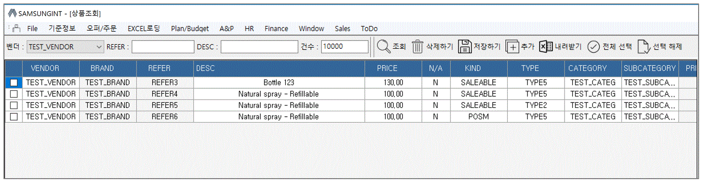
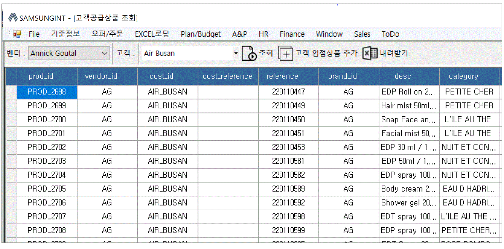
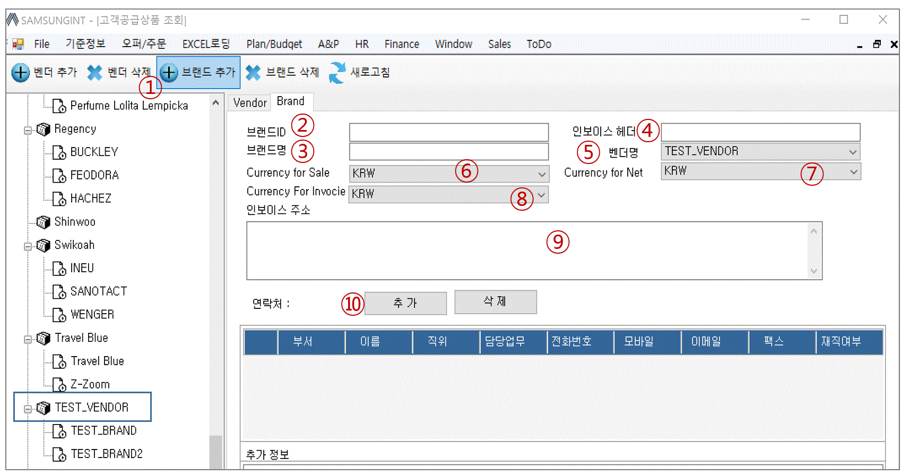
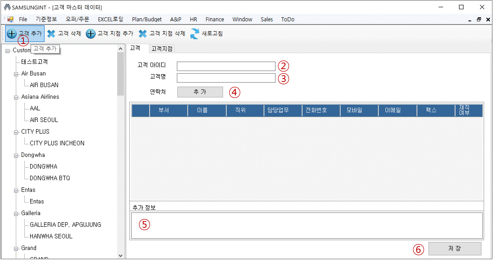
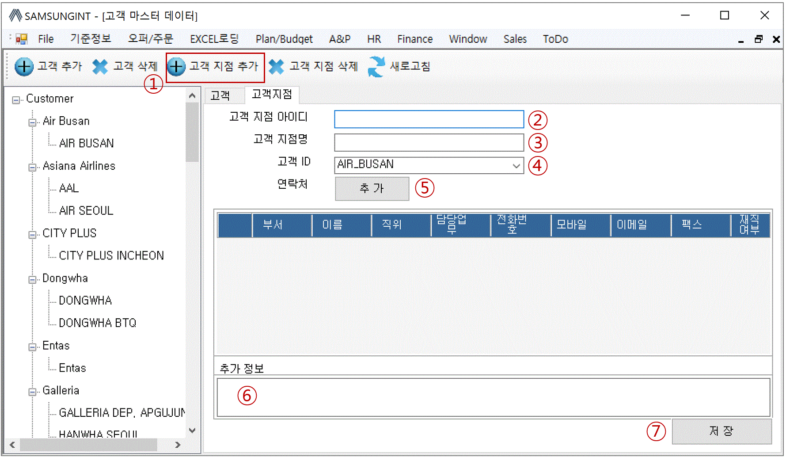
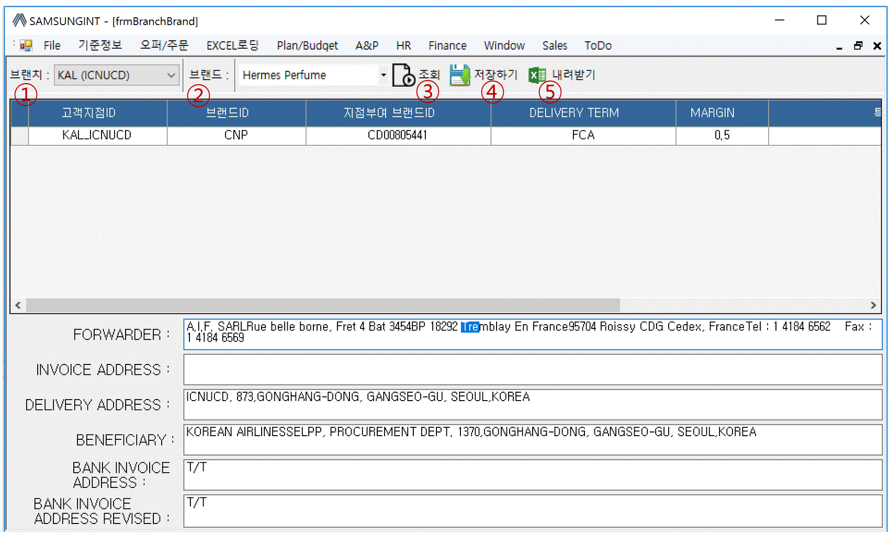

== 기준 정보 관리 == 
[기준 정보] 메뉴에서는  마스터 데이터를 관리하는 기능들을 제공하고 있다. 

=== 상품 마스터 데이터 조회 ===
업무에 사용되는 각 벤더별 상품 데이터에 대한 정보는 핵심 데이터 중 하나이다.  상품 데이터 업로드를 하기 전에 우선 현재 상품 정보를 조회할 수 있는 방법에 대해서 설명하겠다. 

상품 정보 조회 방법::
프로그램 메뉴에서 [기준 정보] -> [상품 정보] 를 클릭한다.  

조회::
선택된 벤더와 검색 조건을 이용하여 상품 정보를 조회한다. 

삭제하기::
상품 리스트 화면에서 선택되어진 상품을 삭제한다. 삭제된 상품 정보는 다시 복구할 수 없기 때문에 주의 하여햐 한다.

상품 정보 수정::
상품 정보 그리드에서 변경하고자 하는 정보를 선택하고 F2 키를 누르거나, 더블 클릭을 천천히 하면 해당 정보를 수정할 수 있다. 상품 정보가 수정된 상품은 자동으로 선택표시가 표시된다. 

저장하기::
해당 상품의 변경된 정보를 저장한다. 

추가::
상품 정보를 추가할 수 있다. 상품 추가는 [추가] 버튼을 통해서 추가할 수도 있고 , 나중에 설명하는 엑셀 업로드 기능을 사용하여 할 수도 있다. 

전체선택::
전체 상품을 선택할 수 있다. 

선택 해제::
현재 선택된 상품의 선택을 해제한다.

내려받기::
현재 조회한 상품 정보를 Excel 파일로 다운로드 할 수 있다. 

=== 브랜드별 입점 정보 ===
벤더가 제공하는 상품들이 어떤 고객 지점에 입점되어 있는지 확인할 수 있는 기능이다. 고객 지점의 상품으로 등록되어 지지 않은 상품은 오퍼를 통해서 제품을 주문할 수 없다. 

벤더::
조회하고자 하는 벤더를 선택할 수 있다. 

고객::
조회하고자 하는 고객 지점을 선택한다. 

고객 입점 상품 추가 ::
현재 버전에서는 엑셀을 통한 업로드와, 오퍼를 생성하는 화면에서 개별 상품별로 등록할 수 있다. 해당 기능을 소개할 때 자세히 설명하겠다. 

내려받기::
현재 조회된 데이터를 엑셀로 내려 받을 수 있다. 

=== 벤더 - 브랜드 ===
새로운 벤더를 생성하거나, 특정 벤더의 브랜드를 추가하고자 할 때 사용한다. 

==== 벤더 생성 ====
image::images/add_vendor.gif[]

. 벤더 추가 ::
벤더를 생성하고자 하는 경우 클릭한다. 우측 화면에서 '벤더ID' 를 입력하는 입력 상자가 활성화 된다. 

. 벤더ID ::
벤더 ID 를 입력한다. 

. 벤더명 ::
벤더명을 입력한다. 

. 벤더명(KOR)::
한글 벤더명을 입력한다. 

. 연락처 추가 ::
벤더의 연락처를 추가할 수 있다. 

. 연락처 삭제 ::
선택한 연락처를 삭제한다. 

. 저장 ::
현재까지 입력한 벤더 정보를 저장한다. 추가된 벤더는 왼쪽 트리에서 확인할 수 있다. 

==== 벤더 삭제 ==== 
화면의 왼쪽 트리에서 삭제할 벤더를 선택한 후 '벤더 삭제' 버튼을 클릭한다. 

==== 브랜드 생성 ====
왼쪽 화면에서 브랜드를 추가할 벤더를 선택한 후 위 메뉴 중 '브랜드 추가' 버튼을 누른다. 

. 브랜드 추가 : 선택한 벤더 아래로 브랜드를 생성한다. 

. 브랜드 ID : 추가할 브랜드의 ID 를 입력한다. 기존에 존재하는 ID 를 입력하면 브랜드 생성이 되지 않는다. 

. 브랜드명 : 생성할 브랜드 이름을 입력한다. 

. 인보이스 헤더 : 해당 브랜드에 대한 인보이스를 만들 때  인보이스 번호를 생성하게 된다. 인보이스 번호(예:AGXXXXXXXX) 는 인보이스 헤더를 포함하는데, 이 때 사용되는 인보이스 헤더를 지정한다. 

. 벤더명 : 브랜드가 속하게 되는 벤더명이다. 왼쪽 창에서 선택한 벤더명이 여기에 표시된다. 

. Currency for Sale : Sales 에 사용되는 통화 단위를 지정한다. 

. Currency for Net : 순이익에 사용되는 통화 단위를 지정한다 

. Currency for Invoice : 인보이스에 사용되는 통화 단위를 지정한다. 

. 인보이스 주소 : 인보이스에 기록되는 인보이스 주소를 지정한다. 

. 연락처 추가 : 해당 브랜드의 연락처 정보들을 지정한다. 

필요한 정보를 입력했으면 하단의 '저장' 버튼을 클릭한다. 

==== 브랜드 삭제 ====
선택한 브랜드를 삭제한다. 

=== 고객사 정보 ===
고객과 고객 지점에 대한 기준 정보를 입력한다. 

==== 고객 추가 ====
신규 고객을 등록해야 하는 경우 [기준 정보] -> [고객사 정보] 메뉴를 클릭하면 고객 등록 화면을 확인할 수 있다. 

. 고객 추가 : 새로운 고객을 추가하려면 '고객 추가' 버튼을 클릭한다. 

. 고객 아이디 : 추가하려는 고객의 ID 를 입력한다. 

. 고객명 : 추가하려는 고객명을 입력한다. 

. 연락처 추가 : 고객 연락처 정보를 입력한다. 

. 추가정보 : 고객에 대한 기타 정보를 입력한다. 자유 포맷이기 때문에 아무런 내용이나 입력하면 된다. 

. 저장 : 입력한 정보를 바탕으로 새로운 고객을 생성한다. 

==== 고객 삭제 ====
삭제하려는 고객을 선택하고 '고객 삭제' 버튼을 누르면 고객을 삭제할 수 있다. 

==== 고객 지점 추가 ====
특정 고객 이하에 신규 고객 지점 등록이 필요하면, 해당 '고객' 을 왼쪽 화면에서 클릭한 후 '고객 지점 추가' 버튼을 클릭한다. 

. 고객 지점 추가 : 신규 고객 지점을 추가하고자 할 때 클릭한다. 

. 고객 지점 아이디 : 추가하고자 하는 고객 지점의 아이디를 입력한다. 기존에 존재하는 아이디를 입력하면 생성이 되지 않는다. 

. 고객 지점명 : 추가하고자 하는 고객 지점명을 입력한다. 

. 고객 ID : 왼쪽 창에서 선택한 고객ID 를 확인할 수 있다. 자동으로 해당 고객 ID 가 설정된다. 

. 연락처 추가 : 고객 지점의 연락처 정보를 추가한다.

. 추가 정보 : 고객 지점에 대한 추가 정보를 자유로운 형식으로 입력한다.

. 저장 : 입력한 정보를 바탕으로 고객 지점을 생성한다. 

==== 고객 지점 삭제 ====
삭제하려는 고객 지점을 선택하고, '고객 지점 삭제' 버튼을 클릭한다. 

==== 새로 고침 ====
고객 및 고객 지점 정보를 최신 내용으로 갱신한다. 

=== 거래 기본 정보 ===
'거래 기본 정보' 기능은 고객 지점과 브랜드 사이의 거래에 대한 기본 정보를 입력하는 기능이다. '거래 기본 정보' 데이터를 입력하려면, [기준 정보] -> [거래 기본 정보] 를 클릭한다. 

. 브랜치: 고객 지점을 선택한다. 
. 브랜드: 브랜드를 선택한다. 
. 조 회 : 선택한 고객 지점과 브랜드 간의 거래 정보를 조회한다. 
. 저장하기 : 수정한 내용을 저장한다. 
. 내려받기 : 조회한 내용을 엑셀로 내려 받는다.  여기서 내려 받은 엑셀을 나중에 데이터를 업로드 할 때 템플릿으로 활용할 수 있다. 

==== 거래 기본 정보 생성 ====
현재 버전에서 새로운 거래 기본 정보를 생성하려면, [EXCEL 로딩] 기능을 이용해야 한다. 해당 메뉴를 설명하는 장에서 자세히 설명한다. 

